Example
=======

Particle Filter Interactive Example
-----------------------------------
This example demonstrates the overall theory of the particle filter. To begin this example, navigate to `DARE/examples/Particle_Examples/` and open  `example_particle.py`. 

Running Steps:

0. This example requires numpy and matplotlib packages to run. Ensure that these packages are available in your IDE before beginning this example. 
1. Clone the repository into your local directory.
2. Navigate to the folder `./DARE/examples/Particle_Examples/`.
3. Run the command line `python example_particle.py`. A new window should open and look like this:

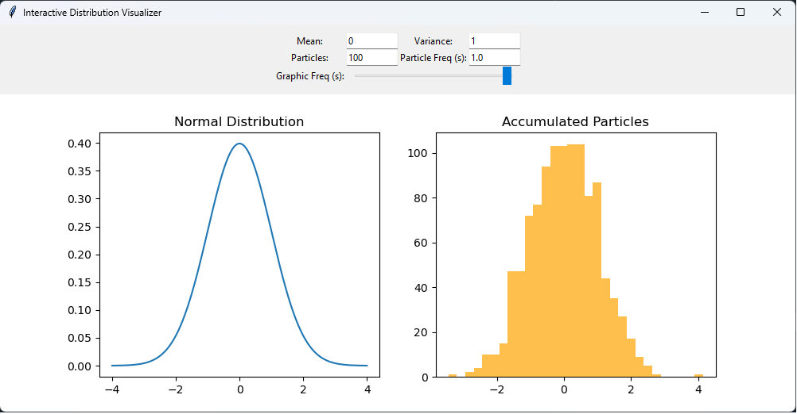

The left distribution ("Normal Distribution") is the unknown distribution that the particle filter will attempt to match through sampling. The right distribution is the particles that have accumulated and resampled to match the left distribution. At the top, there are options to adjust the distribution to observe how the particle filter reorients when a distribution shift occurs. The options are:

1. Mean: This is the left distribution mean. Changing the mean will shift the distribution; the particle filter will attempt to match the new mean.  
2. Variance: This is the left distribution variance (aka spread). The particle filter will attempt to match the variance if modified. 
3. Particles: This is the number of particles that are resampled/added at each update time step. 
4. Particle Freq(s): This is update time step for when particles are resampled and plotted. 
5. Graphic Freq(s): This is how often the visual graphic is updated from small intervals to long intervals. 

This example demonstrates the core principle of particle filters, where given an unknown distribution and measurements, the particles can track any arbitrary distribution. In the PAR-FIT program, this principle is used to track predictions to the underlying dataset.

Steady State Example (No Fault)
-------------------------------
In this example, a particle filter is used to determine when a jump has occured from one steady state value to another. The second steady state value is also valid, represented in the reference dataset, and may represent a change in operational conditions. This example also illustrates the burn-in rate and effect of effective sampling size (ESS) mode of the particle filter for changes in state. 

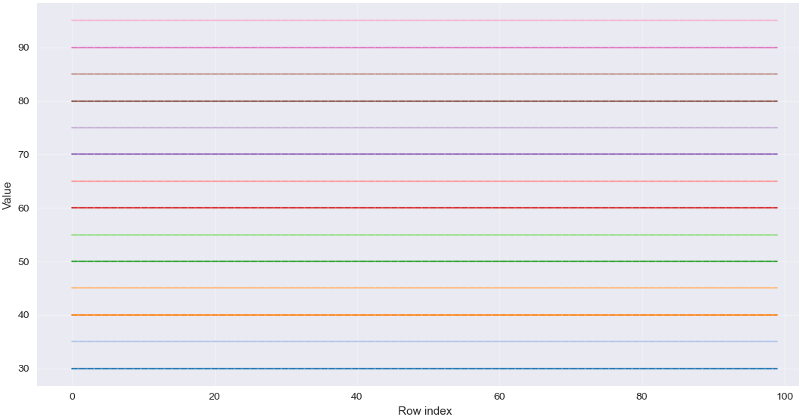
	
	Reference dataset representing normal condition for sensor. Each horizontal line represents a different valid steady-state condition of the sensor. 
	
Running Steps:

0. (Pre-step) This example requires numpy and matplotlib packages to run. Ensure that these packages are available in your IDE before beginning this example. Navigate to `DARE/examples/Particle_Examples/steady_state_example/Steady_State_Example.py` to begin.

1. Run Steady_State_Example.py. Several figures will be generated. The particle filter is utilizing ESS and the multinomial resampling method. 

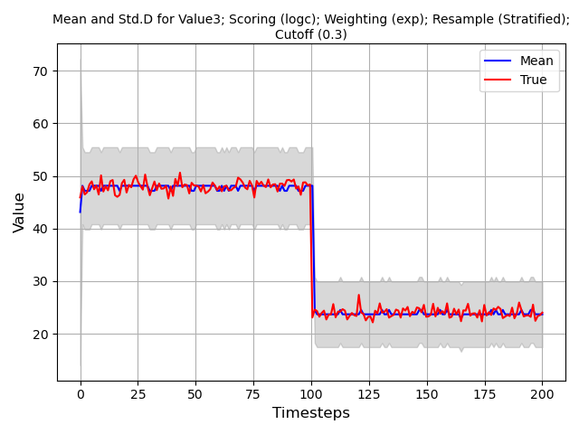
	
	Particle filter mean and std w/ 100 particles, no fault present. 

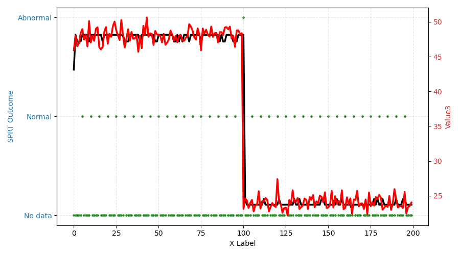
	
	SPRT decision outcome; Abnormal condition is only detected at the step change.
	
In this case, the particle filter is able to track well when ESS is turned on. Notice that the uncertainty band does not converge as a result. This is a sideeffect of ESS as resampling is limited; particles cannot converge if they cannot be resampled. When ESS is turned off, the uncertainty can converge as normal however there are draw backs to it such as longer convergence time and more false positives. 

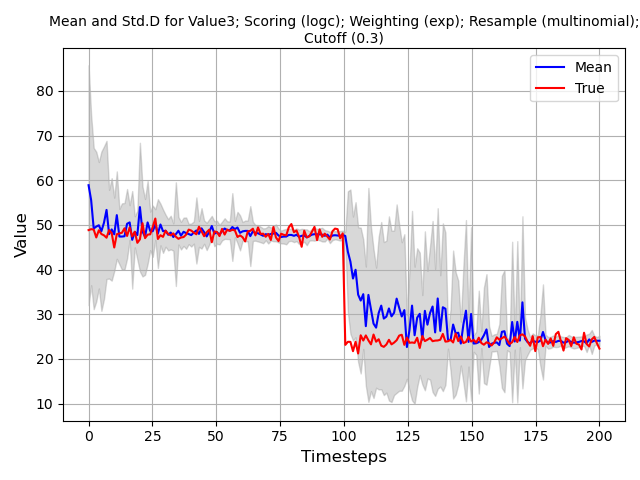
	
	Multinomial resampling with no ESS.

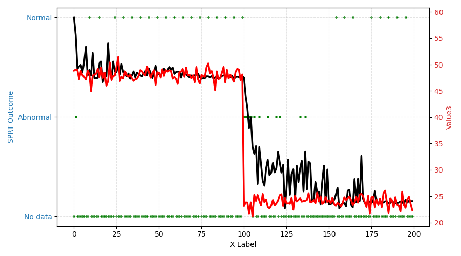
	
	SRPT output with multinomial resampling with no ESS.

Steady State Example (Fault)
----------------------------
In this example, a particle filter is used to determine when a jump has occured from one steady state value to another. However, the second steady state value is not valid and out of scope relative to the reference dataset. This example may represent a broken sensor. This example also illustrates the burn-in rate and effect of effective sampling size (ESS) mode of the particle filter for changes in state. 

Running Steps:

0. (Pre-step) This example requires numpy and matplotlib packages to run. Ensure that these packages are available in your IDE before beginning this example. Navigate to `DARE/examples/Particle_Examples/steady_state_fault_example/Steady_State_Fault_Example.py` to begin.

1. Run Steady_State_Fault_Example.py. Several figures will be generated. The particle filter is utilizing ESS and the multinomial resampling method. 

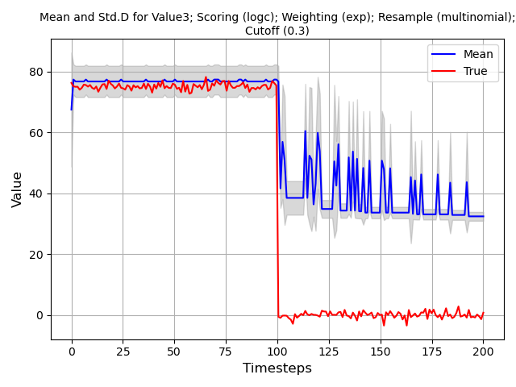
	
	Particle filter mean and std w/ 100 particles, sensor fault present, no output. 

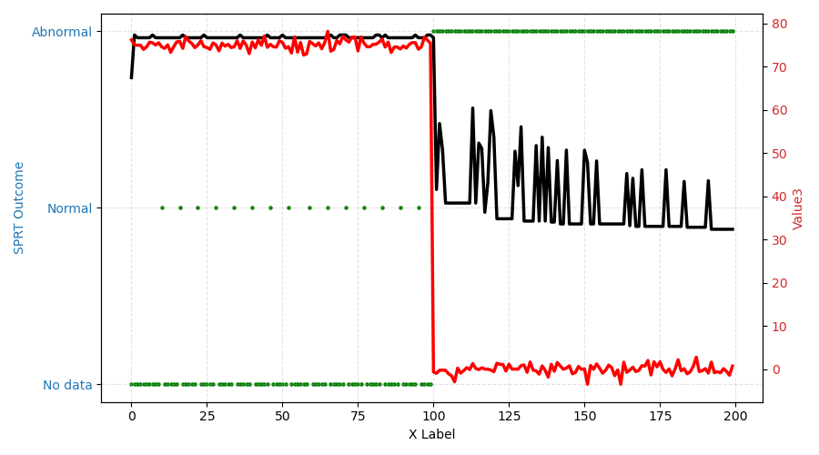
	
	SPRT decision outcome; Abnormal condition is detected when the sensor has failed.
	
In :numref:`SS_fault_ESS` and :numref:`SS_fault_ESS_SPRT`, the particle filter is able to track well while the sensor is operationl. The output of the SPRT also suggests that the sensor is behaving as expected.  At timestep 100, the sensor fails and its output drops to zero. The particle filter detects this change and attempts to track. However, as the zero condition case is not represented in the dataset, the SPRT output indicates and abnormal condition.

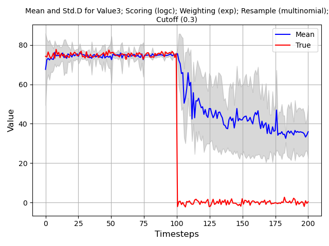
	
	Multinomial resampling with fault and no ESS.

In :numref:`SS_fault_noESS`, ESS is turned off and sampling occurs at each time step. When the particle filter is tracking the sensor value consistently, the uncertainty band is small. When the fault occurs, the error band grows significantly and the particle filter can no longer track the sensor. 

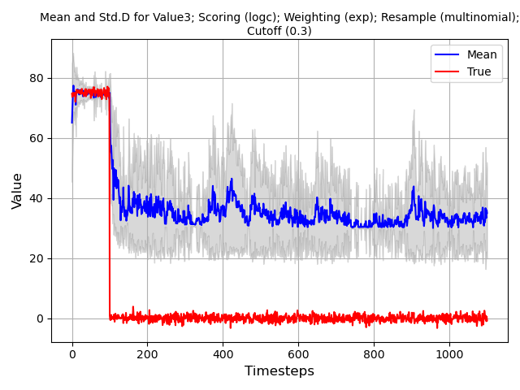
	
	Long run multinomial resampling with fault and no ESS.

In :numref:`SS_fault_noESS_long`, it is demonstrated that the model uncertainty will never converge if the reference data is absent. The particles' output mean and standard deviation is unstable. 

Linear Example (No Fault)	
----------------------------

In this example, the particle filter's performance on ramp functions is demonstrated. The reference data are still steady state constants similar to the steady state case. The intent of this example is to demonstrate how the particle filter reacts when the sensor is increasing or decreasing within its operational limits when the expected behavior is steady state. 

Running Steps:

0. (Pre-step) This example requires numpy and matplotlib packages to run. Ensure that these packages are available in your IDE before beginning this example. Navigate to `DARE/examples/Particle_Examples/linear_nofault_example/Linear_noFault_Example.py` to begin.

1. Run Linear_noFault_Example.py. Several figures will be generated.

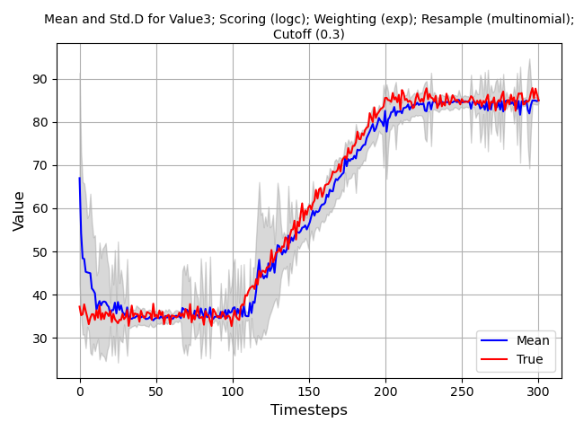
	
	Linear ramp of sensor from one valid state to another with particle filter tracking.
	
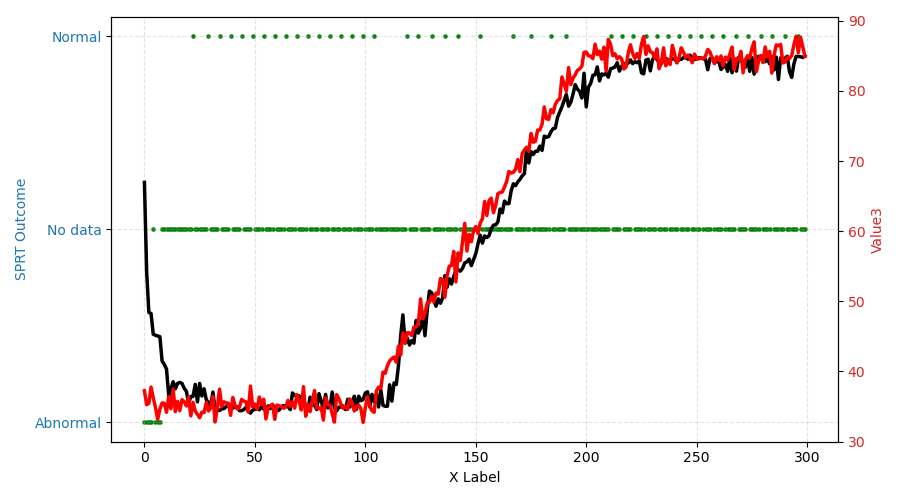
	
	Output of SPRT with ramp from one valid state to another with particle filter tracking.

In this example, even though there is no reference data for linear ramping of sensors, only steady state constant values (see :numref:`ref_dataset` for reference dataset), the SPRT output does not identify an abnormal state. This is because the sensor is still within its valid range (as specified by the reference dataset). 

Linear Example (Fault)	
----------------------------

In this example, the particle filter's performance on ramp functions is demonstrated. Unlike the previous example, the sensor starts in a failed state and linearly ramps through the operational range and to another failed state. 

Running Steps:

0. (Pre-step) This example requires numpy and matplotlib packages to run. Ensure that these packages are available in your IDE before beginning this example. Navigate to `DARE/examples/Particle_Examples/linear_fault_example/Linear_Fault_Example.py` to begin.

1. Run Linear_Fault_Example.py. Several figures will be generated.

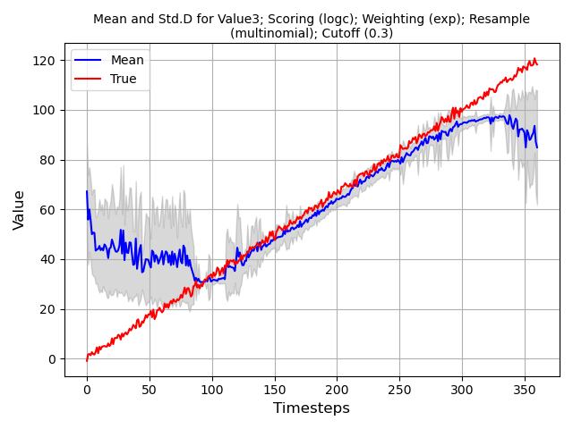
	
	Linear ramp of sensor from one valid state to another with particle filter tracking.
	
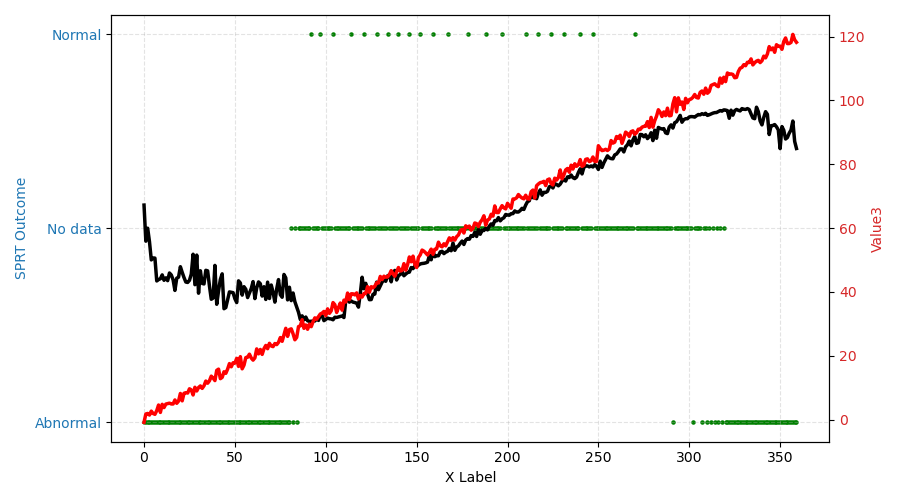
	
	Output of SPRT with ramp from one valid state to another with particle filter tracking.

Two abnormal conditions are detected, at the beginning and end of the example as expected. In :numref:`Linear_fault_noESS`, the particle filter distribution in the abnormal regions is a uniform distribution as no particle is better or worse than another particle. 

  