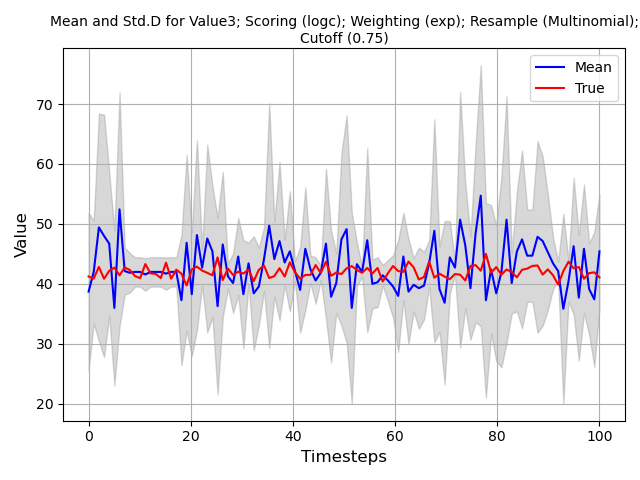
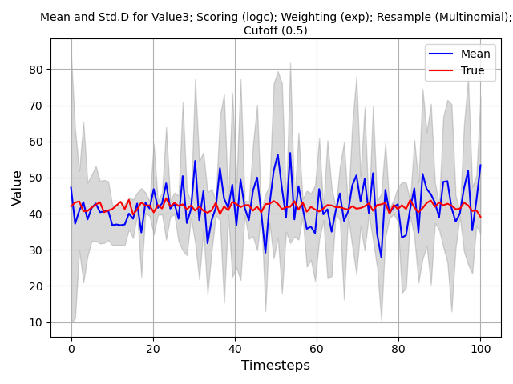
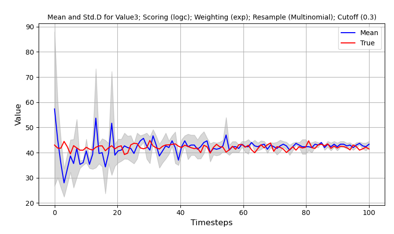
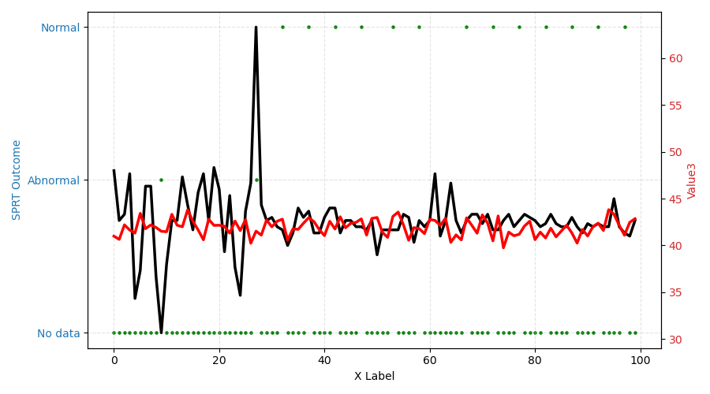

Instructions	
============

This section provides instructions on how to implement your own particle filter using custom data. At minimum, the following function calls must be made and in the following order. The corresponding example can be found in DARE/examples/Particle_Examples/new_filter/main.py.

The mock example illustrates a particle filter run in a `do` loop to simulate real-time calculations. The dataset consists of mock historical sensor values at different constant values ranging from 0 to 50. A mock measured signal  with normal distribution noise (:math:`N(\mu=42,\sigma=0.5`) represents the unknown state of the system. In your implementation, this value comes from your real sensors or models that represent the system at test. The objective of the particle filter is to locate which historical sensor value file most likely matches the measured state. The particle filter will automatically determine if the sensor value is normal or annomalous.  

0. (Pre-step) Identify whether your reference dataset is a single csv file or a collection of csv files. If the data is located in multiple csv files with some common naming format and in a folder named "pf_reference/" then use the "folder_path" option in the initialization of the particle filter. If the data is located in a single csv file, use "data" option in the initialization of the particle filter. This example assumes that the data is located in multiple csv files located in a folder named "pf_reference/".

1. Initialize the particle filter with the corresponding parameters. All optional parameters shown use default values. A full list of available methods can be found in the corresponding documentation section:
	
.. code-block:: python

	NUM_PARTICLES = 10                   # Determines how many particles to generate
	folder_path   = "./pf_reference/"    # Location of reference data
	index_range   = None                 # (Optional)Row range within each csv file 
	COLS = ["Value1", "Value2", "Value3"]# (Optional)Which column values to use
	SCORING       = "mape"               # (Optional)Which scoring method to use 
	WEIGHTING     = "exp"                # (Optional)Which weighting method to use
	RESAMP        = "multinomial"        # (Optional)Which resampling method to use
	REPLACE       = 0.2                  # (Optional)How many particles to resample randomly
	PREPROC       = None                 # (Optional)Which preprocessing method to use
	THRESHOLD     = 0.5                  # (Optional)Used with the threshold resampling method
	CUTOFF        = 0.75                 # (Optional)What percentage of particles to drop in calculations 
	
	pf_swarm = Swarm(
			num_particles=NUM_PARTICLES,
			folder_path=CSV_FOLDER,
			selected_cols=COLS,
			scoring=SCORING,
			weighting=WEIGHTING,
			repopulate=RESAMP,
			replacement_rate=REPLACE,
			preprocessing=PREPROC,
			threshold=THRESHOLD,
			population_cut=CUTOFF
		)

2. Initialize your "do" loop with mock incoming measurement signals. Assume that the particle filter is used every time a measurement is received. Signals must be located in a dictionary where the key is the sensor name and the value is the measurement.

.. code-block:: python

	for _, row in measured_signal.itterows():
		row = row.to_dict()      # This is the first signal received by the program.
	
3. Update all particles in the filter. This is used to ensure that each particle has made a prediction and can later be evaluated. 

.. code-block:: python

	pf_swarm.predict()
	
4. Tracking information on the mean and standard deviation of particle predictions may be collected here. An optional parameter `cutoff` can be specified to reduce noise in particle output. This example stores the information in two lists; `mean_particles` and `std_particles`.

.. code-block:: python
	
	mean = pf_swarm.get_mean_pred(cutoff=CUTOFF)
	std  = pf_swarm.get_std_pred(cutoff=CUTOFF)
	mean_particles.append(mean)
	std_particles.append(std)
	
5. Calculate the score of all particles relative to the measured signal. 

.. code-block:: python

	pf_swarm.calculate_score(row)
	
6. Calculate the weight of every particle relative to their score.

.. code-block:: python

	pf_swarm.calculate_weights()
	
7. Eliminate poor performing particles and repopulate with existing particles.

.. code-block:: python

	pf_swarm.repopulate()
	
8. (Optional) Given that this is time-series information, the particles next prediction can be updated with foward. This moves the particle from the current time step to the next time step. If this step is not used, the particle will continue tracking the current prediction.

.. code-block:: python

	pf_swarm.forward()
	
Particle Filter Visualization
----------------------------------
For this example, the entire dataset is visualized to show how the particle filter converges as more data is available. The cutoff percentage is also demonstrated to illustrate how uncertainty can be reduced by eliminating irrelevant particles. The following code block generates similar image shown below. NOTE: As particle filters are probabilistic, the image generated will not be the same each time. 

.. code-block:: python

    for col in COLS:
        # Plotting mean and standard deviation
        mean = [d[col] for d in mean_particles]
        std  = [d[col] for d in std_particles]
        X = np.linspace(0, len(measured_signal), num=len(measured_signal))
        
        lower_bound = np.array(mean)-np.array(std)
        upper_bound = np.array(mean)+np.array(std)
        
        plt.figure()
        plt.plot(X, mean, color='blue', label='Mean')
        plt.plot(X, measured_signal[col], c="red", label="True")
        plt.fill_between(X, lower_bound, upper_bound, color="gray", alpha=0.3)
    
        # Labels and legend
        plt.title(f"Mean and Std.D for {col}; Scoring ({SCORING}); Weighting ({WEIGHTING}); Resample ({RESAMP})", fontsize=10)
        plt.xlabel('Timesteps', fontsize=12)
        plt.ylabel('Value', fontsize=12)
        plt.legend()
        plt.grid(True)
        plt.tight_layout()
        plt.show()

A cutoff value of 0.75 implies that only 7 (rounded down) particles are used in the calculation of mean and std. 

	
	PF w/ 10 particles and cutoff of 0.75

A cutoff value of 0.50 implies that only 5 particles are used in the calculation of mean and std. 

	
	PF w/ 10 particles and cutoff of 0.50
	
A cutoff value of 0.30 implies that only 3 particles are used in the calculation of mean and std. Selecting how many particles to use has not yet been determined. Cutoff does not affect resampling, only the end mean and std calculation. 

	
	PF w/ 10 particles and cutoff of 0.3
	
Sequential Probability Ratio Test (Optional)
----------------------------------------------

SPRT is a hypothesis testing method that enables a user to determine if a measured signal is either anomalous or normal. The assumption is that under normal conditions, the residual error has zero bias and a standard deviation of :math:`\sigma`. This deviation can be derived from the operational data or assumptions on the training data about model accuracy. A second distribution is defined for anomalous conditions which can either be similar to the normal condition distribution with larger variance or a different distribution entirely. Hypothesis testing is conducted by evaluating whether a sequence of samples fits within the normal or anomalous condition distributions. 

Significance levels are used to specify the sensitivity of the method to detecting conditions. :math:`\alpha` and :math:`\beta` specifies the false alarm (spurious) and missed alarm probabilities respectively.   
 
1. To enable Sequential Probability Ratio Test to evaluate the output of the model, import the SPRT module and add it to the code as follows:

.. code-block:: python

	from SPRT import SPRT
	...
	pf_swarm = Swarm(...)
	
	# Setup SPRT parameters
	ALPHA        = 0.05
	BETA         = 0.10
	normal_mean  = 0
	normal_var   = 10
	bias         = 0
    k_var        = 3
	reset_window = 25
	pf_SPRT  = SPRT(alpha=ALPHA,
			beta=BETA,
			normal_mean=normal_mean,
			normal_var=normal_var,
			bias=bias,
			k_var=k_var,
			reset_window=reset_window
		)

2.  Within the "do" loop of your particle filter add the following lines:

.. code-block:: python

	residual = list({key: mean[key] - row[key] for key in mean if key in row}.values())
	decision = pf_SPRT.calculate_SPRT(residual) # Calculates the decision outcome from SPRT using residual
	
Visualization
----------------------------------
Similar to the visualization of the particle filter example, the SPRT output can be shown. SPRT has four possible outcome states. Note that as SPRT uses the mean and std to calculate an output, the parameter `cutoff` indirectly influences the decision outcome. 

- NORMAL: This state indicates that the signal is normal relative to historical data.
- ABNORMAL: This state indicates that the signal is abnormal relative to historical data.  
- NO DATA: This state indicates there is insufficient information to make a determination on the outcome. More data needs to be collected at subsequent timesteps. 
- RESET: This state is triggered when the maximum data collection window specified by (`reset_window`) is reached. The internal state of the SPRT is erased and data on the next state is collected.
	
.. code-block:: python

	# Plot SPRT outcome
    fig, ax1 = plt.subplots(figsize=(9, 5))
    x = np.arange(start=0, stop=len(SPRT_outcome)) 
    
    # Plot first series on left Y axis
    ax1.scatter(x, SPRT_outcome, color='g', s=5, label='Outcome')
    ax1.set_xlabel('X Label')               
    ax1.set_ylabel('SPRT Outcome', color='tab:blue')
    ax1.tick_params(axis='y', labelcolor='tab:blue')
    ax1.grid(True, which='major', linestyle='--', alpha=0.35)
	
	# Plot second series on right Y axis
    ax2    = ax1.twinx() # Create a second axes sharing the same x-axis 
    line2, = ax2.plot(x, pd.DataFrame(mean_particles)["Value3"], color='k', linewidth=2.5, label='True')
    line3, = ax2.plot(x, measured_signal["Value3"], color='r', linewidth=2.5, label='Measured')
    ax2.set_ylabel('Value3', color='tab:red')
    ax2.tick_params(axis='y', labelcolor='tab:red')
    plt.tight_layout()
    plt.show()
	

	
	SPRT outcome with w/ 10 particles and cutoff of 0.3.
	
In :numref:`SPRT_output_03`, the RESET state is absent as it is never triggered. There is sufficient data to make a conclusion within the user specified time window length. Prior to the particle filter stabilizing, the model predicts 2 abnormal states. After the model stabilizes, the SPRT prediction is that the signal is normal. 