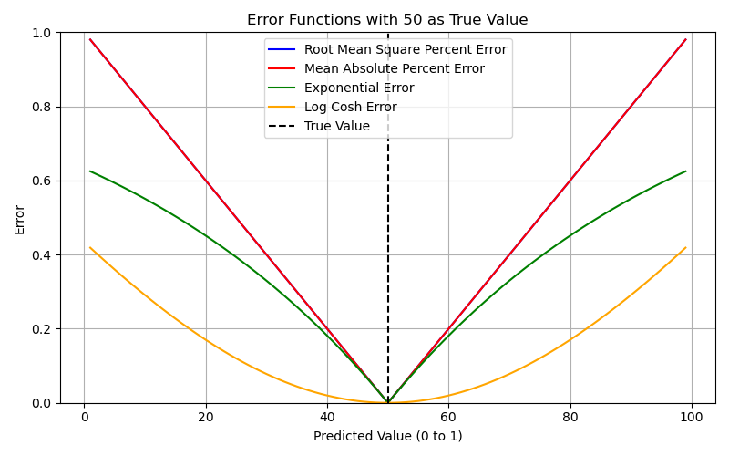
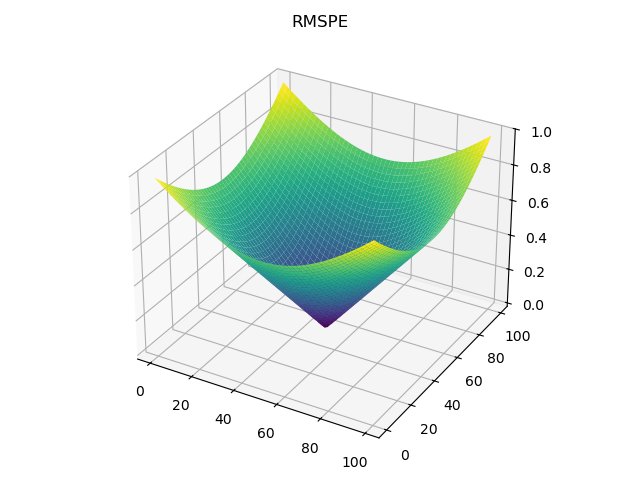
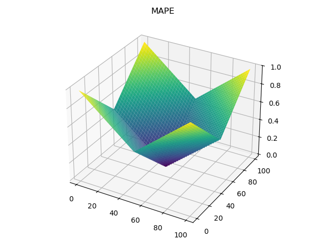
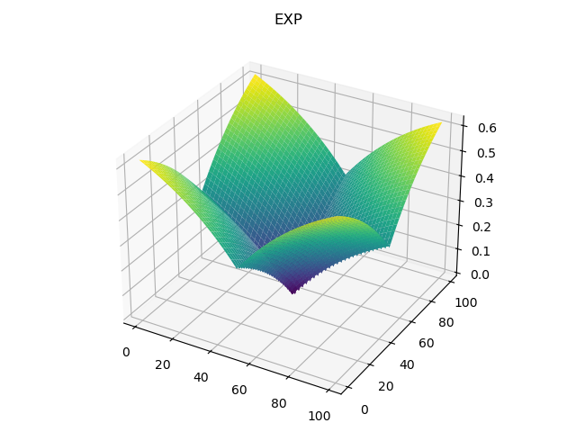
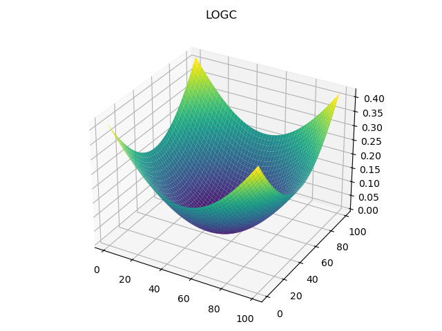

Scoring Library
===============
This library contains the scoring functions used in the particle filter. There are five different functions that can be used.

Root Mean Square Percent Error (RMSPE)
--------------------------------------

	
.. math::
	E_{RMSPE}=\sqrt{\frac{100}{n}(\sum_{i=0}^n r^2_i} \tag{1}
	
	
Mean Absolute Percent Error (MAPE)
----------------------------------

	
.. math::
	E_{MAPE}=\frac{100}{n} \sum_{i=0}^n |r_i|

Exponential Decay (EXP)
-----------------------

	
.. math::
	E_{EXP}=\frac{a}{n}\sum_{i=0}^n (1-\exp(-|r_i|))
	
Log Cosh (LC)
-------------

	
.. math::
	E_{LC}=\frac{1}{n} \sum_{i=0}^n (\log{\cosh{r_i}})

Function Definitions
--------------------
.. autofunction:: Scoring.calculate_rmspe_score
.. autofunction:: Scoring.calculate_mape_score
.. autofunction:: Scoring.calculate_exp_score
.. autofunction:: Scoring.calculate_logCosh_score
