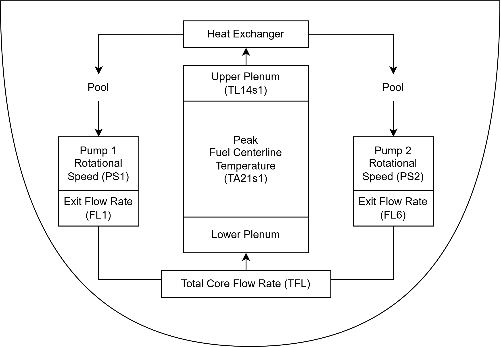
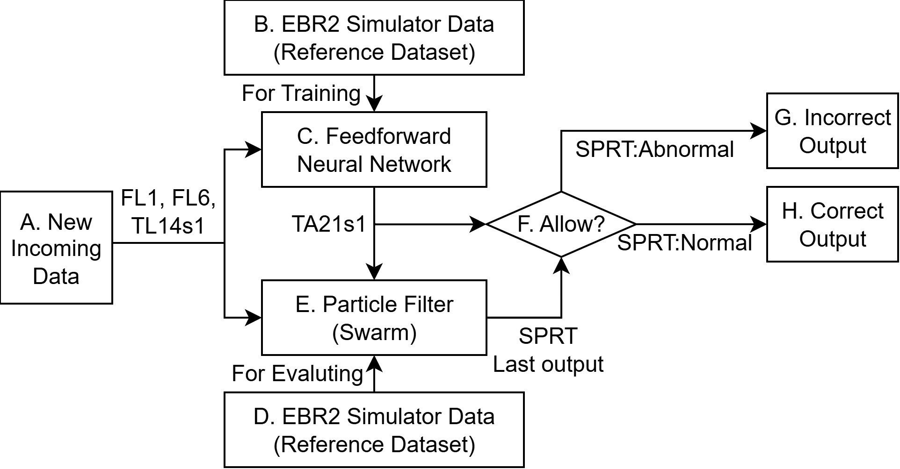
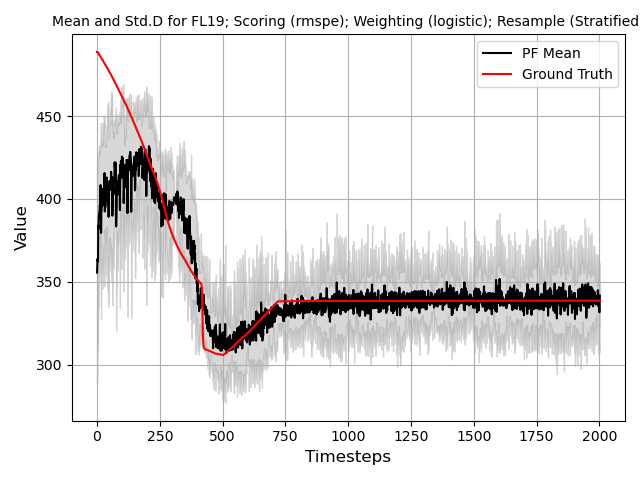
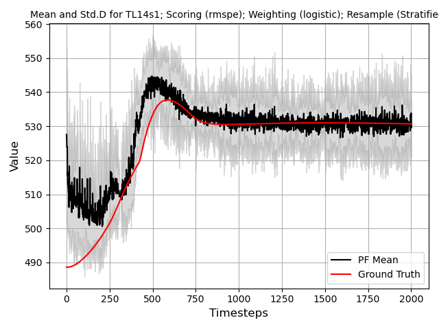
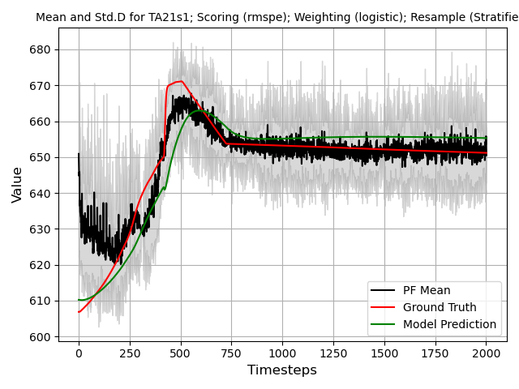
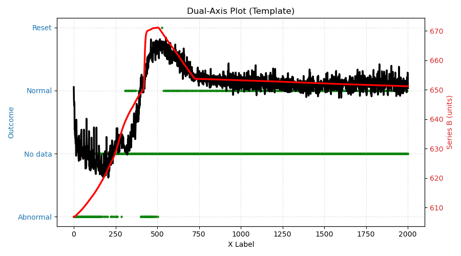
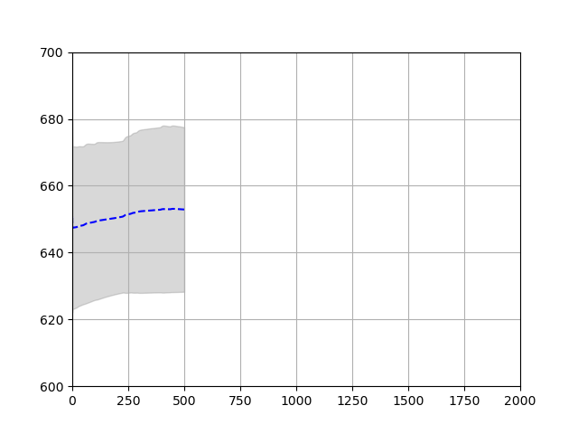

Transient Example	
=================

In this example, the GOTHIC simulation of the EBR-2 reactor is used to model a loss of flow transient. EBR-2 is a pool type sodium fast reactor. As the name implies, the coolant is stored in a pool which maintains a consistent temperature for all submerged components. The simulation consists of two sodium coolant pumps which draws from the pool and feeds into the EBR2 core block. The core consists of a lower plenum where the coolant mixes and flows into the core region where the fuel rods are located. The coolant ideally cools the fuel rods and maintains a temperature lower than 700C. At the top of the core block is the upper plenum where the coolant mixes again and travel to the heat exchanger. The heat exchanger dissipates the heat to an unmodeled secondary system (e.g., steam generator) and dumps the remaining hot coolant back into the pool. A diagram of the model is shown in :numref:`EBR2_Drawing`. 

	
	High level overview of EBR2 drawing with variables mapped.

The parameters used in the EBR2 model include:

- Pump rotational speed (:math:`\omega`/s): PS1 & PS2
- Pump exit flow rate (kg/s): FL1 & FL6
- Total core flow rate (kg/s): TFL (FL1+FL6)
- Upper plenum temperature (C): TL14s1
- Peak fuel centerline temperature (C): TA21s1

Here, only the peak fuel centerline temperature is an unmeasurable quantity (in real life) as placement of sensors in the fuel bundle is an engineering challenge. Therefore, we would like to use measurable parameters (e.g., TFL and TL14s1) to infer what the fuel centerline temperature could be. The GOTHIC model is used to generate a plausible fuel centerline temperature which will be used to train a predictive model.

A feedforward neural network (FNN) is implemented as the predictive model. The input to the neural network are the measurable parameters FL1, FL6, and TL14s1. More parameters can be used, however a Pearson correlation of measurable parameters to the unmeasurable parameters indicates that FL1, Fl6, and TL14s1 has the highest correlation (i.e., most indicative of temperature). 

The particle filter is used here to determine: a) the future state of the fuel centerline temperature (i.e., forecasting), b) the uncertainty of the each individual parameter, and c) the reactor state (normal or abnormal) during the course of the transient. 

The framework for this example is shown in :numref:`FlowDiagram`. 

	
	Framework connecting the FNN with the particle filter.

From A-H:

A. This is the mock data that simulates new real time information arriving into the framework. The timestep size is 0.1 seconds per step. The incoming information is a transient that is not within the reference dataset (B).

B. This the simulator dataset that was constructed using EBR2. A variety of different scenarios is posited and modelled. However, the dataset is not comprehensive and not intended to represent an exhaustive search of possible actions, only reasonable actions that an plant operator may take.

C. The reference dataset is used to train a FNN. The FNN uses the pump flow rates (FL1 & FL6) and the upper plenum temperature (TL14s1) to predict the fuel centerline temperature (TA21s1). In this example, the performance of the FNN is irrelevant; if the FNN predicts poorly, then the particle filter should identify more samples as abnormal and vice versus. 

D. Whatever was used to train the FNN is used as the reference data for the particle filter. The assumption is that some degree of validation was performed on the reference data and is believed to be correct. This reference data can be swapped with real operational data if it exists and can be collected. 

E. This is the particle filter. The particle filter receives several values, both from the incoming data and the FNN output. The particle filter compares all information available to the reference dataset to make a determination of reactor state. 

F. The output of particle filter (from a controls perspective) is the SPRT state decision. If the SPRT state is normal, then the output is routed to the correct downstream systems (denoted as H). If the SPRT state is abnormal, then the output is routed to a protection system (denoted as G). 

H. Indicator of normal state of plant.

G. Indicator of abnormal state of plant. 

Transient Fault Description
---------------------------

The datasets were gathered and simulated using a GOTHIC model of the Experimental Breeder Reactor-II (EBR-II) [Lane2020]. In EBR-II, two separate primary sodium pumps (denoted as P1 and P2), provide coolant flow through the core. In the postulated transient scenario, P1 partially loses pump rotational speed, thus decreasing the overall coolant flow through the core block. The scenario is monitored by a supervisory system (unmodelled). Based on the supervisory system's automated response, the rotational speed of P2 is increased to compensate. The scope of the numerical demonstration can be represented by the time-dependent curve of the rotational speed of P1 seen below.

.. math::

	\omega_1(t) = \omega_0(1-\frac{1-(\omega_1)_{end}}{T_1}t_0)
	
Here :math:`\omega_0` is the nominal pump speed, :math:`T_1` is the ramp-down duration, :math:`(\omega_1)_{end}` is the normalized P1 end speed, and :math:`t_0` is the transient start time. 

Instructions
----

To run this example, follow the below instructions:

0. (Pre-step) This example requires pytorch, matplotlib, pandas, numpy, and celluloid to generate the associated figures and images. Pip install these modules if not already installed.

1. Navigate to DARE/Examples/Particle_Examples/transient_example/transient_example.py

2. In the command line of your python, run below. This ensures that images are generated in a new window rather than in the IDE window. This is primarily for the forcasting GIF.

.. code:: python

	matplotlib qt

3. Run the code. This code may take some time as image processing and parametric tracking are resource intensive. It should take approximately 133 seconds to complete.

Issues:

- `The code runs too slowly?` Find the line `NUM_PARTICLES` and reduce to 50. This should speed up the calculation without significant degradation of performance.

- `The code doesn't run, modules are missing?` See pre-step for package requirements.  

- `The GIF is a static image?` The GIF needs a separate window to appear properly. Use the `matplotlib qt` code line to force new plotting windows. See Step 2. 

Output
------

After running the code, the following images should be generated :numref:`0768_Transient_FL19`, :numref:`0768_Transient_TL14s1`, :numref:`0768_Transient_TA21s1`, :numref:`0768_Transient_SPRT`, and :numref:`RT_Transient`. 
 

	
	Total core flow rate particle filter tracking. 
	

	
	Upper plenum temperature particle filter tracking. 
	

	
	Fuel centerline temperature model prediction with particle filter tracking. 
	

	
	SPRT output on fuel centerline temperature prediction with particle filter. 

	
	Forcasting using particle filter. 

References
----------

.. [Lane2020] J. W. Lane, J. M. Link, J. M. King, T. L. George and S. W. Claybrook, "Benchmark of GOTHIC to EBR-II SHRT-17 and SHRT-45R Tests," Nuclear Technology, vol. 206, no. 7, pp. 1019-1035, 2020.