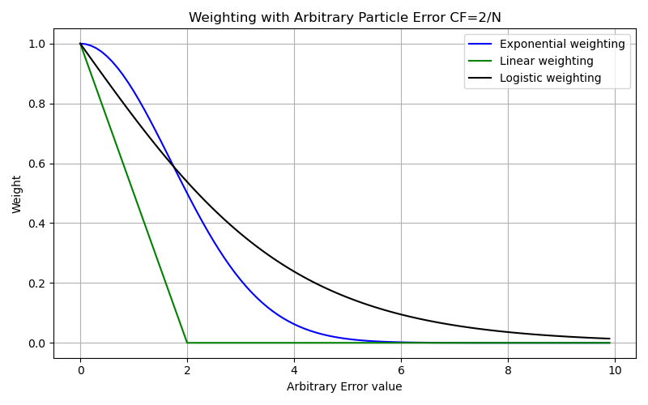

Weighting Library
=================
This library contains the weighting functions used in the particle filter. There are three different functions that can be used. All weighting functions are 1 dimensional.

The weighting function transforms the error function result into normalized weights. Sum normalization is used to ensure weight distributions sum to 1. 

	
Linear 
----------------------------
The linear weighting function determines weights under the assumption that at zero error there is 100% probability of resampling. 

.. math::
	W_{LIN} = 
	\begin{cases}
		1-\frac{E_i}{\beta N} & w_i \gt 0 \\
		0 & w_i \lt 0
	\end{cases}
	
	
Exponential
----------------------------

.. math::
	W_{EXP} = \exp(\alpha E_i^2)
	
.. math::
	\alpha = \frac{\ln(0.5)}{(\beta N)^2}

Logistic 
----------------------------

.. math::
	W_{LGS}= 2 - \frac{2}{1+\exp(-\frac{E_i}{\beta N})}
	

Function Definitions
----------------------------
.. autofunction:: Weighting.calculate_linear_weights
.. autofunction:: Weighting.calculate_exp_weights
.. autofunction:: Weighting.calculate_logistic_weights
